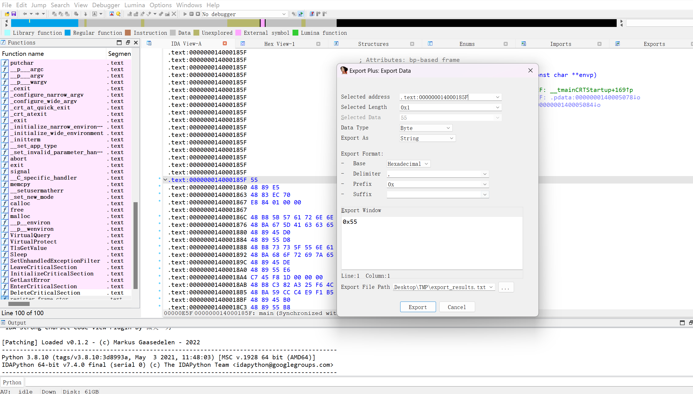
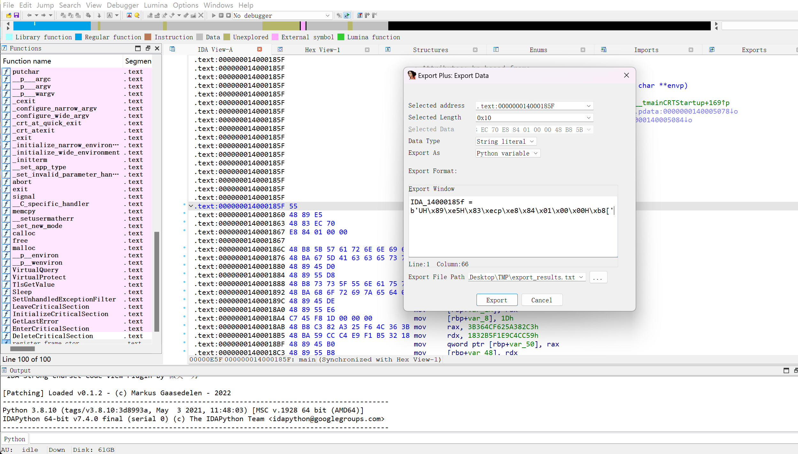
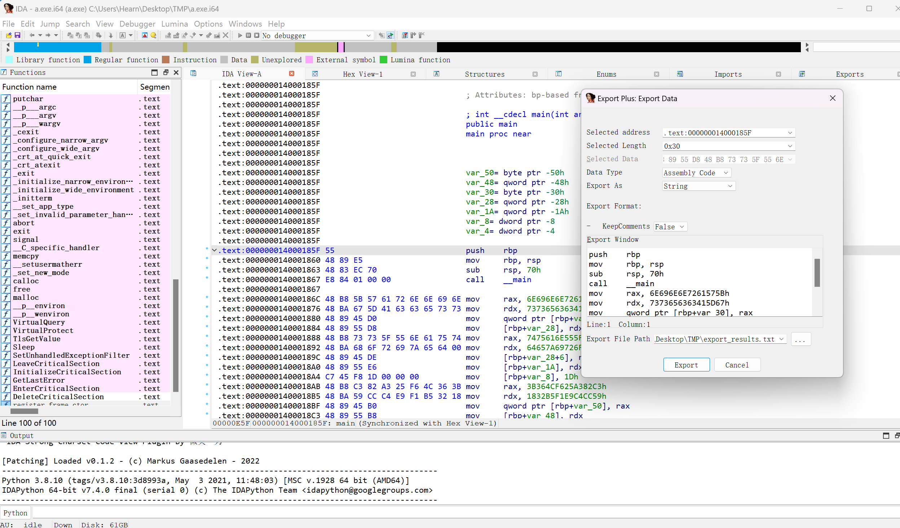

# IDA-DataExportPlus
a IDA Pro plugin for exporting data, it can replace the IDA Pro original Data Export Window.

The plugin supports export data base on different data type. Additional it also supports export assembly code.

## Installation
Copy `DataExportPlus.py` to IDA plugins directory. Requires IDA Pro version 7.6 or above

## Usage
Use hotkey `Shift+E` to Call out the plugin window

You can change the format of the exported data in this window

Exporting assembly code

